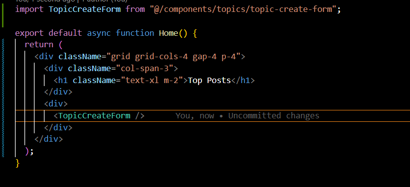

# 19 MArch

## Upfront design Process.

1. Recommended initial design
   

2. Now we should identify all the routes and create a table
   

## Why Path helpers?

1. We are creating path helper functions because sometimes the structure of project become very nasty for example attached image
   

2. To Solve to the above problem we are using the path helper functions.
3. Here is an example of path helpers function
   

## Path helper Implementation

1. Create a path.ts in src
2. This is how we create the path helper function
   

# 20 March

## Creating the routing structure

1. Just create the page.tsx files.
   

## Stubbing out server actions

1. Create three separate files in actions folder
   

2. Just create dummy function and export from actions/index.ts

## Planning Revalidating strategies

1. Add comments to server actions for flushing out cache

## Building the header

1. Create header.tsx in component file
2. Import the header in layout
3. here is the jsx
   

## Displaying the signin and sign out buttons

1. Here is the JSX for this lecture
   

## Enabling Sign out

1. Just wire up the actions with signin/signout buttons
2. Updated JSX
   

## More Caching Issues

1. Right now if we try build the app then homepage will be dynamic but we are not using anything there that will make the page dynamic.
2. For best performance, we want to build our pages statically as much as we can.
3. Problem is cookie is changing inside the header when we are checking if user is logged in or not. That is responsible for making the homepage dynamic.

## Static Caching while using auth

1. Every page that is displaying the header will be dynamic.
2. Solution is to make header component as client components.
3. useSession doesn't directly access cookies.
   

4. Add a new case authContent = null because now we are using client component

## Creating topics

1. Create topic create form component.
2. Update the root page.tsx jsx like this
   

## Creating a Popover form

1. Here is the jsx for TopicCreateForm
   

## Receiving Form Data

1. Just add a name field to Input and text area
2. Fetch name and description from formdata

## Adding Form Validation with Zod

1. Install zod library
2. Create createTopicSchema in server action
   
3. Regex shoud be like this
   
4. Schema will have safe parse function which will work like this
   
5. This is how we will validate form data with zod schema safeparse function
   

## Reminder on the UseFormState Hook

1. Whatever we will be returning from our server actions, will be sent to our component
2. Here is how useFormState hook will work
   

## Fixing UserFormState Type Errors

1. Import useFormState in topic create form. Make it as client component.
2. How to fix the error we are getting when we pass action to useFormState hook.
3. What we return from server action must match with what we put as initial state
   

## Here's our form state type

1. Create this type in action
   
2. Update the server action like this
   

## Displaying validation errors

1. Add this prop to Input or TextArea
   

## Handling General Form Errors

1. add new property to the interface i.e '\_form'
   
2. Now we want to display errors if user is not signed and he is creating new topic.
3. Add this check
   
4. Display the form error like this
   
